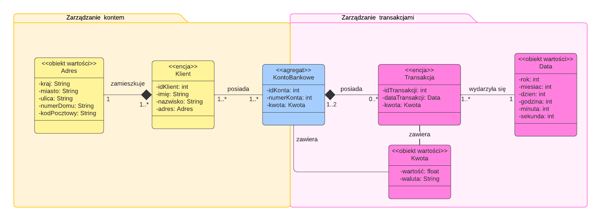

# Zadanie 1 - Domain Driven Design

### Opis zadania

Celem zadania było zdefiniowanie i zamodelowanie fragmentu bezpiecznej aplikacji bankowej wykorzystując podejście Domain-Driven Design (DDD).
W realizowanym bardzo uproszczonym przykładzie zdefiniowałem dwa konteksty:
- zarządzanie kontem - pozwala na usuwanie, dodawanie i edycję właścicieli konta bankowego (klientów) oraz przypisanych do nich adresów.
- zarządzanie transakcjami - pozwala na zarządzanie transakcjami danego konta, np. wypłatami, wpłatami i przelewami.
### Model

### Założenia
| Obiekt       | Atrybuty                                      | Ograniczenia                                                                                                                          |
|--------------|-----------------------------------------------|:--------------------------------------------------------------------------------------------------------------------------------------|
| Adres        | kraj, miasto, ulica, numerDomu, kodPocztowy   | Ulica musi znajdować się w danym mieście (zgodnie z kodem pocztowym), które musi znajdować się w podanym kraju.                       |
| Klient       | idKlient, imię, nazwisko, adres               | Unikalny identyfikator klienta.                                                                                                       |
| KontoBankowe | idKonta, numerKonta, kwota                    | Unikalny identyfikator konta, unikalny numer konta, który musi składać się z 26 cyfr.                                                 |
| Transakcja   | idTransakcji, dataTransakcji, kwota           | Unikalny identyfikator transakcji, nie można stworzyć transakcji z datą wcześniejszą niż obecna, kwota transakcji nie może być ujemna.|
| Kwota        | wartość, waluta                               | Waluta przedstawiona jako ciąg 3 liter zgodnie ze standardem ISO 4217                                                                 |
| Data         | rok, miesiąc, dzień, godzina, minuta, sekunda | Każde z pól musi zawierać liczbę, która mieści się w odpowiednim dla niej przedziale, np. dla godzina to liczba pomiędzy 0 a 23.      |